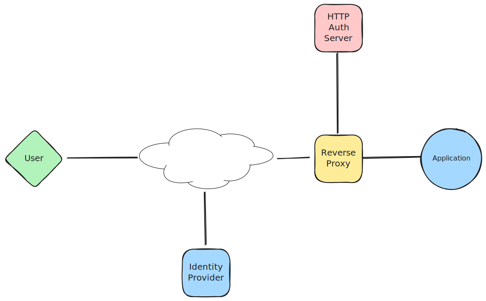

# go-http-auth-server

[](https://goreportcard.com/report/github.com/andrewheberle/go-http-auth-server)

This service combines some basic functionality of [Authelia](https://www.authelia.com/) with a SAML Service Provider so that HTTP authentication sub-requests to `/api/verify` or `/api/authz/forward-auth` are checked against the presence of a valid session otherwise a SAML authentication process is started.

## Overview

The process for login is:

1. A reverse proxy, such as HAProxy, gets a HTTP request from a user
2. This proxy verifies the authentication of the user via a HTTP sub-requet to `/api/authz/forward-auth`
3. If the user is already authenticated the `/api/authz/forward-auth` returns a `HTTP 200 OK` response along with HTTP headers the proxy may use to identify the user
4. If no valid session is available, a redirect is returned to the proxy which should be returned to the user, which will start the SAML login process

## Architecture



## Configuration

### Minimal Required Configuration

The following example shows configuration via environment variables:

```sh
AUTH_SP_CERT=/config/samlsp.crt \
AUTH_SP_KEY=/config/samlsp.key \
AUTH_IDP_METADATA=https://idp.example.net/metadata \
./http-auth-server
```

### Command Line Options

```
      --cert string                       HTTPS Certificate
      --db-connection string              Database connection string
      --db-prefix string                  Database table prefix
      --debug                             Enable debug logging
  -h, --help                              help for http-auth-server
      --idp-certificate string            IdP Certificate/Public Key
      --idp-issuer string                 IdP Issuer/Entity ID
      --idp-metadata string               IdP Metadata URL
      --idp-sso-endpoint string           IdP SSO/login Endpoint
      --key string                        HTTPS Key
      --listen string                     Listen address (default "127.0.0.1:9091")
      --sp-cert string                    Service Provider Certificate
      --sp-claim-mapping stringToString   Mapping of claims to headers (default [remote-user=urn:oasis:names:tc:SAML:attribute:subject-id,remote-email=mail,remote-name=displayName,remote-groups=role])
      --sp-cookie                         Cookie Name set by Service Provider (default "token")
      --sp-key string                     Service Provider Key
      --sp-url string                     Service Provider URL (default "http://localhost:9091")
```

All command line options may be set via environment variables by prefixing the long name with `AUTH_`.

## Session Attribute Storage

Depending on the size of the claims returned from the IdP the data could be too large to include in the cookie set containing the login token/JWT.

For this reason, the token only contains minimal data with the rest contained server side in an "attribute store".

By default this store is a basic in-memory store, which means it cannot be shared among multiple instances of this service and also will be lost on restart. The loss of this data on restart is not particularly problematic as the only result will be that the SP will not be able to validate the user is signed in and force the login flow to the IdP.

If using muliple nodes however, using the in-memory store will cause unexpected re-authentiations if requests are handled by different instances.

When using multiple instances, it is possible to use a PostgreSQL database to store this content.

### Using the same database for multiple deployments

All instances of the same Service Provider should share the same configuration options, including the database store, however if seperate service providers are configured using the same database there is the chance incorrect claims may be returned.

To allow sharing of the same database between seperate Service Providers, the `db-prefix` option will ensure this data is stored in seperate tables.

### Cookie Name

The login "token" is stored as a JWT in a cookie named "token" by default. It is important to ensure that seperate SP's use distinct cookie names to ensure JWT's are correctly validated and not overwritten.
